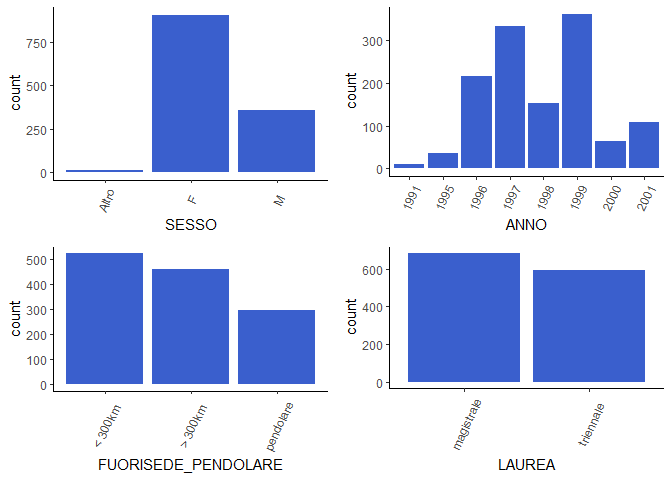
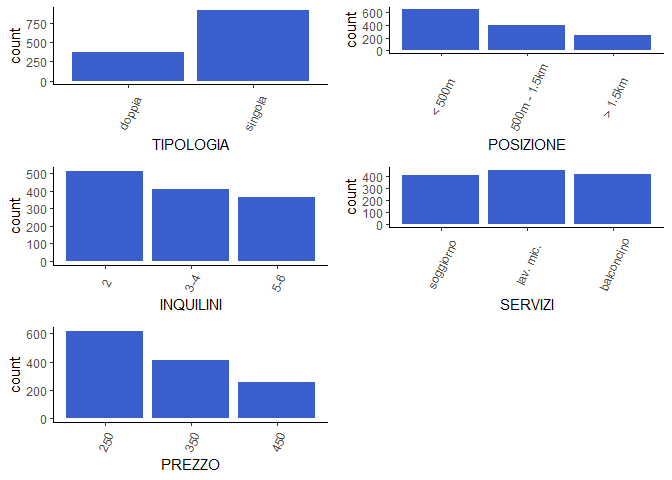
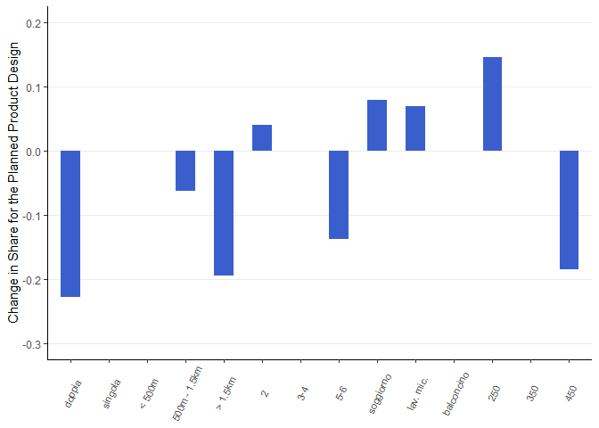
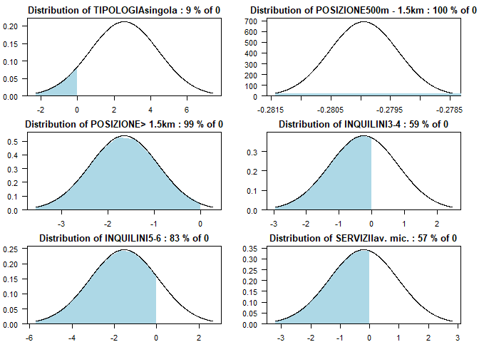
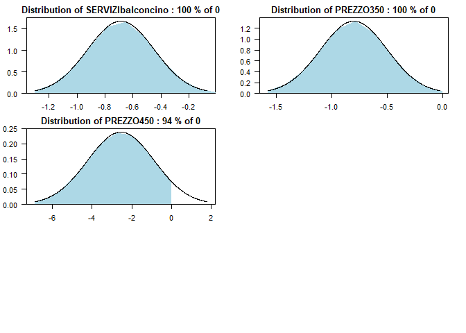
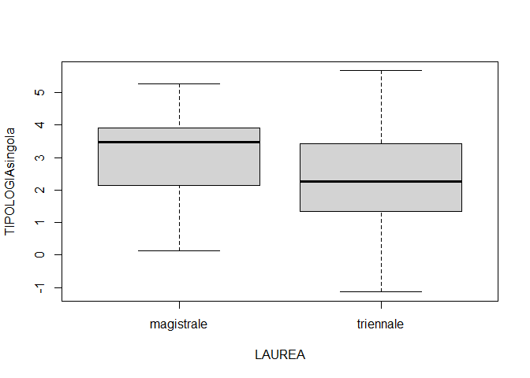
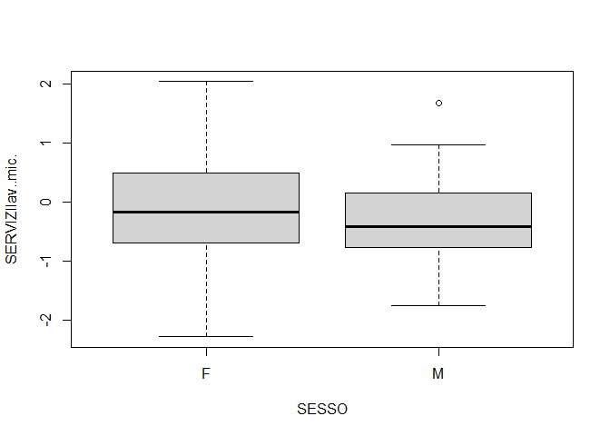
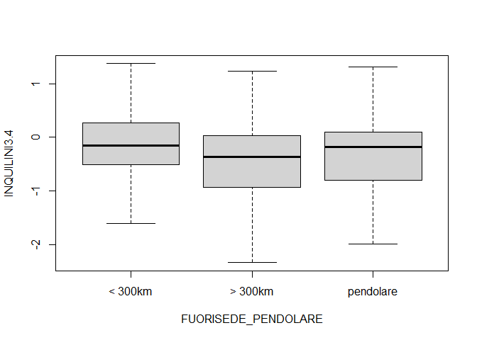

Choice-based Conjoint Analysis - Student accommodation
================
Fattorel Marta & Tonin Marco

<style>
body {
text-align: justify}
</style>

## Introduction

The Covid-19 pandemic has profoundly changed the market in some sectors.
This is the case of the housing market, especially in those cities in
which there is a large number of students who live in. Due to the
current situation, most of the university lessons are online or with a
blended modality. Moreover, there are restrictions in the use of
libraries or other university facilities. As a consequence, a lot of
students have decided to not live in the city of the university, living
in their parents’ house for example.

This situation inevitably enhances the necessity of real estate agencies
or private people to understand customer preferences, in order to find
tenants for the rooms or the apartments they have.

The aim of this Choice-based Conjoint Analysis is to investigate
customer preferences about student accommodation according to four
different attributes:

  - typology: ‘single’; ‘shared/double’
  - position (distance from the university): ‘\<500m’; ‘500m - 1.5km’;
    ‘\>1.5km’
  - number of tenants: ‘2’; ‘3-4’; ‘5-6’
  - facilities: ‘living-room’; ‘balcony in the room’; ‘dishwasher and
    microwave’
  - prices (in euros): ‘250’, ‘350’, ‘450’

Moreover, the research tries to analyse the preference share of Marta’s
room with respect to other seven product profiles found in the Facebook
group ‘AAA Appartamenti studenti Trento’, which represents the student
accommodation market nowadays.

To sum up, the questions this research has the aim to answer are:

  - Which room’s features are considered the most important by students?
    Which attributes’ levels are associated with a positive part worth?

  - How can we assess the preference of a specific product profile we
    want to launch on the market? How can we increase its success?

  - Are students’ preferences homogeneous towards the choice of the
    room?

## Experimental Design and Data Collection

The choice-based conjoint survey uses a *Fractional Factorial Design*
with a *Mix and Match* approach. This permits to have a fraction of all
the possible profiles, respecting orthogonality, avoiding potentially
dangerous patterns the rotation method has, while keeping a small number
of questions. However, in this way it is not possible to assess the
combined effects of the attributes.

Given the high number of questions, we have decided to divide the
choice-based survey into *2 blocks*, both with *9 questions* with *3
alternatives* each.

In addition to the attributes mentioned in the introduction, the survey
provides us some individual information:

  - year of birth
  - sex
  - degree
  - if they live in the city or they reach it with means of transport
    (fuori sede/pendolare)

The two surveys have been created and distributed through the ‘Google
Moduli’ platform \[1\]. The sample design follows a snowball sampling,
in which existing study subjects recruit future subjects among their
acquaintances. We have considered only university students (Master’s,
Bachelor’s and PhD).

Load necessary libraries

``` r
library(data.table)
library(ggplot2)
library(ggpubr)
library(support.CEs)
library(tidyverse)
library(mlogit)
library(parallel)
library(MASS)
library(lattice)
```

Build the survey using a fractional factorial design and a mix and match
approach.

``` r
attrib <- list(TIPOLOGIA = c("singola", "doppia"), 
               POSIZIONE = c("meno di 500m", "500m - 1.5km", "più di 1.5km"),
               INQUILINI = c("2", "3-4", "5-6"),
               SERVIZI = c("soggiorno", "balconcino in camera", "lavastoviglie e microonde"),
               PREZZO = c(250, 350, 450))

MMSurvey <- rotation.design(attribute.names=attrib,
                            nalternatives=3,
                            nblocks=2,        # 9 questions per block
                            randomize=TRUE,   # mix and match approach
                            seed=999)         # for reproducibility
# MMSurvey
# questionnaire(MMSurvey) 
```

Organize the questionnaire in a dataframe format.

``` r
MMSurveyDF <- NULL
nalt <- MMSurvey$design.information$nalternatives
for(i in seq(1:nalt)) {
  MMSurveyDF <- rbind(MMSurveyDF, MMSurvey$alternatives[[i]])
}
MMSurveyDF <- MMSurveyDF[order(MMSurveyDF$BLOCK, MMSurveyDF$QES),] 

head(MMSurveyDF)
```

    ##    BLOCK QES ALT TIPOLOGIA    POSIZIONE INQUILINI                   SERVIZI
    ## 1      1   1   1   singola più di 1.5km         2 lavastoviglie e microonde
    ## 19     1   1   2    doppia 500m - 1.5km       3-4      balconcino in camera
    ## 37     1   1   3   singola più di 1.5km       5-6 lavastoviglie e microonde
    ## 2      1   2   1   singola meno di 500m         2      balconcino in camera
    ## 20     1   2   2    doppia 500m - 1.5km       3-4 lavastoviglie e microonde
    ## 38     1   2   3   singola più di 1.5km       5-6                 soggiorno
    ##    PREZZO
    ## 1     350
    ## 19    350
    ## 37    450
    ## 2     350
    ## 20    450
    ## 38    250

## Data cleaning - Responses

Load the files ‘block1.csv’ and ‘block2.csv’, which contain the data of
the two blocks of the survey. They have been downloaded from ‘Google
Moduli’. In particular, block 1 counts 74 respondents of which 2 have
been removed because they are not university students, while block 2
counts 70 respondents. Therefore, our sample is composed of 142
university students.

Data have been merged, renaming the columns.

``` r
resp1 <- read.csv('block1.csv')
resp2 <- read.csv('block2.csv')

resp1$BLOCK <- 1
resp2$BLOCK <- 2

# Merge the blocks
resp <- rbind(resp1, resp2)

# Rename columns
resp <- resp %>% rename("ANNO" = "Anno.di.nascita.",
                        "SESSO" = "Sesso.",
                        "FUORISEDE_PENDOLARE" = "Sei.studente.studentessa.",
                        "LAUREA" = "Sei.studente.studentessa..1",
                        "Q1" = "Scegli.il.profilo.che.preferisci.",  
                        "Q2" = "Scegli.il.profilo.che.preferisci..1",
                        "Q3" = "Scegli.il.profilo.che.preferisci..2",
                        "Q4" = "Scegli.il.profilo.che.preferisci..3",
                        "Q5" = "Scegli.il.profilo.che.preferisci..4",
                        "Q6" = "Scegli.il.profilo.che.preferisci..5",
                        "Q7" = "Scegli.il.profilo.che.preferisci..6",
                        "Q8" = "Scegli.il.profilo.che.preferisci..7",
                        "Q9" = "Scegli.il.profilo.che.preferisci..8")
# Rename profiles
resp[resp == 'Profilo 1'] <- 1
resp[resp == 'Profilo 2'] <- 2
resp[resp == 'Profilo 3'] <- 3
# Remove timestamp
resp$Informazioni.cronologiche <- NULL
resp$ID <- seq.int(nrow(resp))
# Remove non students 
resp <- resp[!resp$FUORISEDE_PENDOLARE == "non sono studente/studentessa",]
```

The function `make.dataset()` of the package `support.CEs` allows us to
create a dataset with information about the survey and the responses.

``` r
# Create Dataset
dataset <- make.dataset(respondent.dataset = resp,
                        choice.indicators = c("Q1", "Q2", "Q3", "Q4", "Q5",
                                              "Q6", "Q7", "Q8", "Q9"),
                        design.matrix = MMSurveyDF)

dataset$RES[dataset$RES == TRUE] <- 1

dataset <- dataset[c('ID', 'QES', 'ALT', 'BLOCK', 'TIPOLOGIA', 'POSIZIONE',
                'INQUILINI', 'SERVIZI', 'PREZZO', 'SESSO', 'ANNO',
                'FUORISEDE_PENDOLARE', 'LAUREA',
                'RES')]
```

``` r
# Fix questions number 
dataset$QES <- ceiling(as.numeric(rownames(dataset))/3)

# Shorten some df entries names
levels(dataset$SERVIZI) <- c(levels(dataset$SERVIZI), "balconcino", "lav. mic.") 
dataset$SERVIZI[dataset$SERVIZI == "balconcino in camera"]  <- "balconcino" 
dataset$SERVIZI[dataset$SERVIZI == "lavastoviglie e microonde"] <- "lav. mic."

dataset$FUORISEDE_PENDOLARE <- as.factor(dataset$FUORISEDE_PENDOLARE)
levels(dataset$FUORISEDE_PENDOLARE) <- c(levels(dataset$FUORISEDE_PENDOLARE), "< 300km", "> 300km") 
dataset$FUORISEDE_PENDOLARE[dataset$FUORISEDE_PENDOLARE %like% "fuorisede entro"] <- "< 300km"
dataset$FUORISEDE_PENDOLARE[dataset$FUORISEDE_PENDOLARE %like% "fuorisede oltre"] <- "> 300km"

levels(dataset$POSIZIONE) <- c(levels(dataset$POSIZIONE), "< 500m", "> 1.5km")
dataset$POSIZIONE[dataset$POSIZIONE == "meno di 500m"] <- "< 500m"
dataset$POSIZIONE[dataset$POSIZIONE == "più di 1.5km"] <- "> 1.5km"

# Save dataframe
write.csv(x=dataset, file="df.csv", row.names=FALSE)
```

## Data exploration

In order to gain an overall view of the collected data, we start with an
exploratory data analysis. All respondents are repeated the same amount
of time, meaning that each of them saw 27 product profiles. Concerning
the attributes, the table below shows the frequency for each level of
each attribute. All levels are quite balanced.

``` r
# Load dataset
dataset <- read.csv("df.csv")

# summary(dataset)
# str(dataset)
# sapply(dataset, function(x) sum(is.na(x)))                       # no NA values

# Check the number for each id and variable: 
# all respondents are repeated the same amount of time (27 product profiles)
# table(dataset$ID)

sapply(dataset[,5:9], table) # small differences due to the different number of responses in the two blocks
```

    ## $TIPOLOGIA
    ## 
    ##  doppia singola 
    ##    1912    1922 
    ## 
    ## $POSIZIONE
    ## 
    ##       < 500m      > 1.5km 500m - 1.5km 
    ##         1272         1280         1282 
    ## 
    ## $INQUILINI
    ## 
    ##    2  3-4  5-6 
    ## 1278 1274 1282 
    ## 
    ## $SERVIZI
    ## 
    ## balconcino  lav. mic.  soggiorno 
    ##       1278       1278       1278 
    ## 
    ## $PREZZO
    ## 
    ##  250  350  450 
    ## 1282 1276 1276

``` r
# Convert into qualitative
dataset$ALT <- as.factor(dataset$ALT)
dataset$ALT <- recode_factor(dataset$ALT, "1" = "first", "2" = "second", "3" = "third")
dataset$PREZZO <- as.factor(dataset$PREZZO)
dataset$ANNO <- as.factor(dataset$ANNO)
# Change levels order
dataset$POSIZIONE <- factor(dataset$POSIZIONE, levels=c("< 500m","500m - 1.5km","> 1.5km"))
dataset$SERVIZI <- factor(dataset$SERVIZI, levels=c("soggiorno","lav. mic.","balconcino"))
```

``` r
plot.data(dataset[dataset$RES == 1, 5:13])
```

<!-- --><!-- -->

The first four plots display some personal features of the respondents.
The majority of them are females, born between 1996 and 1999 and
non-resident in the city where they study. Master’s students exceed
Bachelor’s ones.  
The other plots represent the general respondents’ choices: a single
room, close to the university, for 2 students, at the lowest price
appears to be the most popular choice for the attributes. The services
results are quite balanced.

## Data analysis

### Multinomial Logit model

We can start our analysis by fitting a Multinomial Logit model on our
data. The `dfidx()` function is necessary in order to reshape the data
in the format required by `mlogit()`.

``` r
data.mlogit <- dfidx(dataset, idx = list(c("QES", "ID"), "ALT"), drop.index=F,
           levels=c("first", "second", "third")) # position of the alternatives

m1 <- mlogit(RES ~ TIPOLOGIA + POSIZIONE + INQUILINI + SERVIZI + PREZZO, data = data.mlogit)
summary(m1)
```

    ## 
    ## Call:
    ## mlogit(formula = RES ~ TIPOLOGIA + POSIZIONE + INQUILINI + SERVIZI + 
    ##     PREZZO, data = data.mlogit, method = "nr")
    ## 
    ## Frequencies of alternatives:choice
    ##   first  second   third 
    ## 0.34429 0.32081 0.33490 
    ## 
    ## nr method
    ## 6 iterations, 0h:0m:0s 
    ## g'(-H)^-1g = 9.77E-06 
    ## successive function values within tolerance limits 
    ## 
    ## Coefficients :
    ##                         Estimate Std. Error  z-value  Pr(>|z|)    
    ## (Intercept):second    -0.0098578  0.0894880  -0.1102  0.912284    
    ## (Intercept):third     -0.1041529  0.0872400  -1.1939  0.232530    
    ## TIPOLOGIAsingola       1.6117682  0.1136623  14.1803 < 2.2e-16 ***
    ## POSIZIONE500m - 1.5km -0.3073381  0.1184303  -2.5951  0.009456 ** 
    ## POSIZIONE> 1.5km      -1.2448225  0.1337612  -9.3063 < 2.2e-16 ***
    ## INQUILINI3-4          -0.1842692  0.1039950  -1.7719  0.076410 .  
    ## INQUILINI5-6          -0.9666814  0.1137254  -8.5001 < 2.2e-16 ***
    ## SERVIZIlav. mic.      -0.0269365  0.1117449  -0.2411  0.809514    
    ## SERVIZIbalconcino     -0.3513543  0.1244398  -2.8235  0.004750 ** 
    ## PREZZO350             -0.6282180  0.0931280  -6.7457 1.522e-11 ***
    ## PREZZO450             -1.8014886  0.1365246 -13.1953 < 2.2e-16 ***
    ## ---
    ## Signif. codes:  0 '***' 0.001 '**' 0.01 '*' 0.05 '.' 0.1 ' ' 1
    ## 
    ## Log-Likelihood: -972.16
    ## McFadden R^2:  0.30732 
    ## Likelihood ratio test : chisq = 862.65 (p.value = < 2.22e-16)

From the coefficient estimates, we notice that both intercepts have a
high p-value, meaning that they could be not relevant. In fact, it makes
sense that the choices of our respondents are not influenced by the
position of the alternatives in the questionnaire. However, before
taking any formal decision, we should estimate the Multinomial Logit
model without the intercepts and compare its performance with the
previous one through a likelihood ratio test.

``` r
# model without the intercepts
m2 <- mlogit(RES ~ TIPOLOGIA + POSIZIONE + INQUILINI + SERVIZI 
             + PREZZO | -1 , data = data.mlogit)
summary(m2)
```

    ## 
    ## Call:
    ## mlogit(formula = RES ~ TIPOLOGIA + POSIZIONE + INQUILINI + SERVIZI + 
    ##     PREZZO | -1, data = data.mlogit, method = "nr")
    ## 
    ## Frequencies of alternatives:choice
    ##   first  second   third 
    ## 0.34429 0.32081 0.33490 
    ## 
    ## nr method
    ## 6 iterations, 0h:0m:0s 
    ## g'(-H)^-1g = 2.99E-06 
    ## successive function values within tolerance limits 
    ## 
    ## Coefficients :
    ##                        Estimate Std. Error  z-value  Pr(>|z|)    
    ## TIPOLOGIAsingola       1.611738   0.114229  14.1097 < 2.2e-16 ***
    ## POSIZIONE500m - 1.5km -0.315874   0.118222  -2.6719  0.007543 ** 
    ## POSIZIONE> 1.5km      -1.242910   0.129364  -9.6078 < 2.2e-16 ***
    ## INQUILINI3-4          -0.181471   0.101675  -1.7848  0.074291 .  
    ## INQUILINI5-6          -0.946899   0.111372  -8.5022 < 2.2e-16 ***
    ## SERVIZIlav. mic.      -0.044284   0.111533  -0.3970  0.691333    
    ## SERVIZIbalconcino     -0.350181   0.121937  -2.8718  0.004081 ** 
    ## PREZZO350             -0.623932   0.092798  -6.7235 1.774e-11 ***
    ## PREZZO450             -1.767213   0.131306 -13.4588 < 2.2e-16 ***
    ## ---
    ## Signif. codes:  0 '***' 0.001 '**' 0.01 '*' 0.05 '.' 0.1 ' ' 1
    ## 
    ## Log-Likelihood: -972.99

``` r
lrtest(m2, m1)
```

    ## Likelihood ratio test
    ## 
    ## Model 1: RES ~ TIPOLOGIA + POSIZIONE + INQUILINI + SERVIZI + PREZZO | 
    ##     -1
    ## Model 2: RES ~ TIPOLOGIA + POSIZIONE + INQUILINI + SERVIZI + PREZZO
    ##   #Df  LogLik Df  Chisq Pr(>Chisq)
    ## 1   9 -972.99                     
    ## 2  11 -972.16  2 1.6553     0.4371

The likelihood ratio test allows us to confirm that the two models
explain equally well the data. In fact, the high p-value tells us that
we have no evidence to reject the null hp of no difference in terms of
goodness of fit between the two models. Hence, we can use the simpler
model, without the intercepts.

Now, let’s verify with another likelihood ratio test if we can consider
the attribute *price* as a quantitative predictor. In this way we would
gain two additional degrees of freedom.

``` r
m3 <- mlogit(RES ~ TIPOLOGIA + POSIZIONE + INQUILINI + SERVIZI + 
               as.numeric(as.character(PREZZO)) | -1 , data = data.mlogit)
# summary(m3)
```

``` r
lrtest(m3, m2)
```

    ## Likelihood ratio test
    ## 
    ## Model 1: RES ~ TIPOLOGIA + POSIZIONE + INQUILINI + SERVIZI + as.numeric(as.character(PREZZO)) | 
    ##     -1
    ## Model 2: RES ~ TIPOLOGIA + POSIZIONE + INQUILINI + SERVIZI + PREZZO | 
    ##     -1
    ##   #Df  LogLik Df  Chisq Pr(>Chisq)   
    ## 1   8 -977.72                        
    ## 2   9 -972.99  1 9.4538   0.002107 **
    ## ---
    ## Signif. codes:  0 '***' 0.001 '**' 0.01 '*' 0.05 '.' 0.1 ' ' 1

This time, the likelihood ratio test displays a value below 0.01. As a
consequence we have evidence to reject the null hp and by looking at the
results we can conclude that m2 better fits our data. Hence, we should
treat the price as qualitative.

So far, the best model results to be “m2” i.e. the model without the
intercepts and with price as a qualitative variable. In addition, by
looking at the estimated coefficients we have an estimate of the average
part worth for each level with respect to the reference level. The most
preferred type of room appears to be: single, close to the university
(less than 500m), for 2 students, living room, 250 euros. Typology,
position and price seem the most relevant attributes.

**Preference share prediction**

We can also use the MNL model to obtain preference share predictions.
Since Marta is looking for a student who is willing to rent her room, we
are going to consider her room as a reference product profile. In
particular, the room is single, for 3 students, less than 500m away from
the university, with a balcony and it costs 310 euros. Instead,
regarding the competitors’ products, we built 7 profiles based on
information retrieved from the Facebook group “AAA Appartamenti studenti
Trento”.

``` r
# Preference share prediction with Bootstrap confidence intervals
source("Bootstrap MNL model.R")
BootCI.predict.mnl(m2, new.data)
```

    ##          share        2.5%      97.5% TIPOLOGIA    POSIZIONE INQUILINI
    ## 98  0.30953630 0.255231966 0.37019145   singola       < 500m       3-4
    ## 70  0.14900139 0.103458676 0.19510459   singola 500m - 1.5km       5-6
    ## 66  0.12676644 0.096458357 0.16390653   singola      > 1.5km       3-4
    ## 140 0.06231888 0.043612243 0.08513550   singola       < 500m       5-6
    ## 61  0.08766467 0.066326584 0.10841007    doppia       < 500m       3-4
    ## 33  0.05308352 0.032932287 0.07499829    doppia 500m - 1.5km       5-6
    ## 1   0.19615835 0.149986153 0.24660227    doppia       < 500m         2
    ## 53  0.01547045 0.008936379 0.02478551    doppia      > 1.5km       5-6
    ##        SERVIZI PREZZO
    ## 98  balconcino    350
    ## 70   soggiorno    350
    ## 66   soggiorno    350
    ## 140  lav. mic.    450
    ## 61   soggiorno    350
    ## 33   lav. mic.    250
    ## 1    soggiorno    250
    ## 53  balconcino    250

The reference profile has the highest preference share, which is around
0.31. This means that on average, respondents are expected to choose it
31% of times.

Now, we are going to plot the sensitivity chart, which shows the
expected changes in preference shares due to changes in each attribute
of our reference profile.

``` r
sensitivity.chart
```

<!-- -->

The most relevant attribute appears to be single room since with a
double room the preference share decreases by more than 0.2%.
Considering that there are some features that we cannot change such as
the position of the room, the number of students that the apartment can
host, and the living room, we should think about adding a dishwasher and
a microwave (+0.06). The price of the room is lower than 350 euros,
however here we had to approximate it to the closest available option.
Hence, with 310 euros the preference share would be higher.

### Consumer Heterogeneity

To control and analyse consumer heterogeneity, we can estimate a
Multinomial Logit Model with random coefficients that vary across
customers. This allows us to relax the assumption of homogeneity in
customer preferences and to deal with the distribution of values of the
parameters that vary across respondents. In this case, we assume that
all the coefficients follow a normal distribution.

``` r
m2.rpar <- rep("n", length=length(m2$coef)) # coef. follow a normal distr.
names(m2.rpar) <- names(m2$coef)

m2.mixed <- mlogit(RES ~ TIPOLOGIA + POSIZIONE + INQUILINI + SERVIZI + PREZZO | -1 , 
                   data = data.mlogit, panel=TRUE, rpar = m2.rpar, correlation = FALSE)
summary(m2.mixed)
```

    ## 
    ## Call:
    ## mlogit(formula = RES ~ TIPOLOGIA + POSIZIONE + INQUILINI + SERVIZI + 
    ##     PREZZO | -1, data = data.mlogit, rpar = m2.rpar, correlation = FALSE, 
    ##     panel = TRUE)
    ## 
    ## Frequencies of alternatives:choice
    ##   first  second   third 
    ## 0.34429 0.32081 0.33490 
    ## 
    ## bfgs method
    ## 23 iterations, 0h:0m:7s 
    ## g'(-H)^-1g = 7.12E-07 
    ## gradient close to zero 
    ## 
    ## Coefficients :
    ##                             Estimate  Std. Error  z-value  Pr(>|z|)    
    ## TIPOLOGIAsingola          2.55874151  0.23551443  10.8645 < 2.2e-16 ***
    ## POSIZIONE500m - 1.5km    -0.27994808  0.16487619  -1.6979  0.089521 .  
    ## POSIZIONE> 1.5km         -1.64244110  0.17946007  -9.1521 < 2.2e-16 ***
    ## INQUILINI3-4             -0.24771233  0.13124913  -1.8873  0.059114 .  
    ## INQUILINI5-6             -1.53129378  0.18167946  -8.4285 < 2.2e-16 ***
    ## SERVIZIlav. mic.         -0.19916419  0.14338615  -1.3890  0.164831    
    ## SERVIZIbalconcino        -0.68726278  0.16587131  -4.1433 3.423e-05 ***
    ## PREZZO350                -0.80022315  0.12757799  -6.2724 3.555e-10 ***
    ## PREZZO450                -2.54714387  0.22207458 -11.4698 < 2.2e-16 ***
    ## sd.TIPOLOGIAsingola       1.88133558  0.24516100   7.6739 1.665e-14 ***
    ## sd.POSIZIONE500m - 1.5km -0.00057661  0.23306601  -0.0025  0.998026    
    ## sd.POSIZIONE> 1.5km      -0.74067211  0.22237162  -3.3308  0.000866 ***
    ## sd.INQUILINI3-4           1.04909143  0.18895054   5.5522 2.821e-08 ***
    ## sd.INQUILINI5-6           1.62062670  0.26326852   6.1558 7.470e-10 ***
    ## sd.SERVIZIlav. mic.       1.16694420  0.18899651   6.1744 6.641e-10 ***
    ## sd.SERVIZIbalconcino     -0.23814246  0.21826260  -1.0911  0.275237    
    ## sd.PREZZO350              0.29981682  0.19566567   1.5323  0.125451    
    ## sd.PREZZO450              1.67484492  0.26862331   6.2349 4.520e-10 ***
    ## ---
    ## Signif. codes:  0 '***' 0.001 '**' 0.01 '*' 0.05 '.' 0.1 ' ' 1
    ## 
    ## Log-Likelihood: -898.38
    ## 
    ## random coefficients
    ##                       Min.    1st Qu.     Median       Mean    3rd Qu. Max.
    ## TIPOLOGIAsingola      -Inf  1.2897999  2.5587415  2.5587415  3.8276831  Inf
    ## POSIZIONE500m - 1.5km -Inf -0.2803370 -0.2799481 -0.2799481 -0.2795592  Inf
    ## POSIZIONE> 1.5km      -Inf -2.1420168 -1.6424411 -1.6424411 -1.1428653  Inf
    ## INQUILINI3-4          -Inf -0.9553137 -0.2477123 -0.2477123  0.4598891  Inf
    ## INQUILINI5-6          -Inf -2.6243899 -1.5312938 -1.5312938 -0.4381977  Inf
    ## SERVIZIlav. mic.      -Inf -0.9862561 -0.1991642 -0.1991642  0.5879277  Inf
    ## SERVIZIbalconcino     -Inf -0.8478874 -0.6872628 -0.6872628 -0.5266381  Inf
    ## PREZZO350             -Inf -1.0024465 -0.8002232 -0.8002232 -0.5979998  Inf
    ## PREZZO450             -Inf -3.6768096 -2.5471439 -2.5471439 -1.4174781  Inf

Let’s first perform a likelihood ratio test in order to compare its
performance with the previous model.

``` r
lrtest(m2, m2.mixed)
```

    ## Likelihood ratio test
    ## 
    ## Model 1: RES ~ TIPOLOGIA + POSIZIONE + INQUILINI + SERVIZI + PREZZO | 
    ##     -1
    ## Model 2: RES ~ TIPOLOGIA + POSIZIONE + INQUILINI + SERVIZI + PREZZO | 
    ##     -1
    ##   #Df  LogLik Df  Chisq Pr(>Chisq)    
    ## 1   9 -972.99                         
    ## 2  18 -898.38  9 149.23  < 2.2e-16 ***
    ## ---
    ## Signif. codes:  0 '***' 0.001 '**' 0.01 '*' 0.05 '.' 0.1 ' ' 1

Looking at the test between the models m2 and m2.mixed, it can be seen
that the p-value is very low, which implies that we have evidence to
reject the null hypothesis that the variances of the random effects are
all jointly equal to zero. Therefore, the random effects are significant
in explaining consumer preferences and the m2.mixed model better fits
with respect to the m2 model.

Now, looking at the output of the m2.mixed model, it can be seen that
some variables have an high standard deviation, which means high
heterogeneity. In particular, these variables are: *TIPOLOGIAsingola*,
*INQUILINI3-4*, *INQUILINI5-6*, *SERVIZIlav. mic.* and *PREZZO450*.
Considering the absolute values of these variables, it can be seen that
for *TIPOLOGIAsingola* and *PREZZO450* the heterogeneity is significant,
but not relevant/strong (estimates are higher than standard deviations).
On the other hand, all the other variables mentioned before show a
relevant heterogeneity (standard deviations are significantly higher
than the estimates).

Moreover, it is interesting to check if there is a change of sign in the
random coefficients, which represent the distribution in quantiles. For
example, in the case of *TIPOLOGIAsingola*, all values are positive,
which means that there is substantial homogeneity in customer
preferences, preferring the single room. Another example is the
distance, *POSIZIONE\> 1.5km*, with all negative values, which means
that there is homogeneity, but students substantially prefer a distance
‘\< 500m’. On the other hand, it can be seen that there is a change of
sign in the variables *INQUILINI3-4* and *SERVIZIlav. mic.*, meaning
that there is heterogeneity in customer preferences according to these
two levels of attributes.

This can be visually seen by plotting the distributions:

``` r
par(mfrow=c(3,2))
par(mar=c(2,3,2,2))
plot(rpar(m2.mixed, "TIPOLOGIAsingola"))
plot(rpar(m2.mixed, "POSIZIONE500m - 1.5km"))
plot(rpar(m2.mixed, "POSIZIONE> 1.5km"))
plot(rpar(m2.mixed, "INQUILINI3-4"))
plot(rpar(m2.mixed, "INQUILINI5-6"))
plot(rpar(m2.mixed, "SERVIZIlav. mic."))
```

<!-- -->

``` r
plot(rpar(m2.mixed, "SERVIZIbalconcino"))
plot(rpar(m2.mixed, "PREZZO350"))
plot(rpar(m2.mixed, "PREZZO450"))
```

<!-- -->

As described before, heterogeneity in customer preferences is confirmed
for the variables *INQUILINI3-4* and *SERVIZIlav. mic..*. Moreover, also
*INQUILINI5-6* shows a certain amount of heterogeneity (however less
than a quantile). In addition, we can say that there could be a market
niche for the variable *INQUILINI5-6*, with the 17% of customers who
whould like to live with other 4/5 flatmates.

Moreover, it can be seen that all the values in the plot about the
position are negative. It means that all students prefer to live near
the university.

Concerning price, it can be seen that there could be another market
niche in the distribution of *PREZZO450*, with 6% of students who can
afford a room that costs 450 euros.

### Assessing the effects of individual-level predictors

Another way to assess respondent heterogeneity is by looking at the
relationships between individual part worths (extracted with `fitted()`)
and individual level variables.

``` r
# extract part woths
PW.ind <- fitted(m2.mixed, type = "parameters")
names(PW.ind)[1] <- "ID"

# heterogeneity wrt degree
degree.data <- unique(dataset[,c(1, 13)])
PW.degree <- merge(PW.ind, degree.data, by="ID")

# heterogeneity wrt sex
sex.data <- unique(dataset[dataset$SESSO != "Altro", c(1, 10)])
PW.sex <- merge(PW.ind, sex.data, by="ID")

# heterogeneity wrt distance from the university (fuori sede/pendolare)
dist.data <- unique(dataset[,c(1, 12)])
PW.dist <- merge(PW.ind, dist.data, by="ID")
```

Let’s first analyze the relationship between the room’s typology and the
degree attended by students.

``` r
boxplot(TIPOLOGIAsingola ~ LAUREA, data=PW.degree)
```

<!-- -->

``` r
# by(PW.degree$TIPOLOGIAsingola, PW.degree$LAUREA, mean)
t.test(TIPOLOGIAsingola ~ LAUREA, data=PW.degree)
```

    ## 
    ##  Welch Two Sample t-test
    ## 
    ## data:  TIPOLOGIAsingola by LAUREA
    ## t = 3.6237, df = 125.34, p-value = 0.0004205
    ## alternative hypothesis: true difference in means is not equal to 0
    ## 95 percent confidence interval:
    ##  0.3769906 1.2842843
    ## sample estimates:
    ## mean in group magistrale  mean in group triennale 
    ##                 3.132188                 2.301551

The boxplots show that both Master’s and Bachelor’s students prefer
single rooms. Bachelor’s students’ data are more spreaded, in fact, even
if the vast majority prefer a single room, there’s also someone who, on
the one hand, tends to choose a double room and on the other hand,
someone else who strongly prefers the single one. Furthermore, as we can
see from the plot and from the t-test, we have evidence that Master’s
students preferences towards the single room is higher than Bachelor’s
ones.

The second relationship we are going to analyze is between sex and
services. Concerning sex, since the category “Altro” counts only one
respondent we are only comparing “F” and “M”.

``` r
boxplot(SERVIZIlav..mic. ~ SESSO, data=PW.sex)
```

<!-- -->

``` r
# by(PW.sex$SERVIZIlav..mic., PW.sex$SESSO, mean)
t.test(SERVIZIlav..mic. ~ SESSO, data=PW.sex)
```

    ## 
    ##  Welch Two Sample t-test
    ## 
    ## data:  SERVIZIlav..mic. by SESSO
    ## t = 1.3806, df = 79.998, p-value = 0.1712
    ## alternative hypothesis: true difference in means is not equal to 0
    ## 95 percent confidence interval:
    ##  -0.08332799  0.46087711
    ## sample estimates:
    ## mean in group F mean in group M 
    ##      -0.1320484      -0.3208230

Once again we have homogeneity in the preferences between the considered
categories of students. Both males and females prefer a living room
rather than a dishwasher and a microwave. The difference between males
and females is really low and not statistically significant.

Finally, we want to assess the relationship between the number of
tenants and if students live in the city where they study or they reach
it with means of transport (pendolare/fuori sede).

``` r
boxplot(INQUILINI3.4 ~ FUORISEDE_PENDOLARE, data=PW.dist)
```

<!-- -->

``` r
# by(PW.dist$INQUILINI3.4, PW.dist$FUORISEDE_PENDOLARE, mean)
```

Even in this case, all students agree and they prefer an apartment for 2
students instead of 3-4. We hypothesized that especially students who
live in the city where they study but reside more than 300km away from
it, could prefer a higher number of flatmates. In fact, we thought that
since they do not have the possibility to come back home often, they are
usually looking for more relationships with other students in the city.
However, the data we have seem to falsify this hypothesis.

## Results and conclusion

The results of our analysis allow us to answer the initial research
questions.

  - **Which room’s features are considered the most important by
    students? Which attributes’ levels are associated with a positive
    part worth?**  
    According to the Multinomial Logit model, our sample of students
    consider the room’s typology, its position and its price as the most
    important features driving their choice. In particular, the room
    should be single, less than 500m away from the university and it
    should have a low price (250 euros). Other features associated with
    the most positive part worths are: 2 tenants and the living room.

  - **How can we assess the preference of a specific product profile we
    want to launch on the market? How can we increase its success?**  
    We have considered Marta’s room as our reference product profile of
    which we want to assess students’ preference in comparison with
    other 7 competitors’ product profiles. By computing the preference
    share and by plotting the sensitivity chart, we gained useful
    information. Students appear to prefer Marta’s room instead of the
    competitors’ ones. We saw that in order to further increase the
    room’s success, we should evaluate if buying a dishwasher and a
    microwave is a sustainable choice.

  - **Are students’ preferences homogeneous towards the choice of the
    room?**  
    The Multinomial Logit Model with random coefficients suggests that
    there is a certain amount of heterogeneity in students’ preferences.
    Concerning the room’s typology, its position and its price there is
    homogeneity: almost everyone prefers a single room, close to the
    university, characterized by a low price (only a really small
    portion of students can afford a 450 euros room). Looking instead at
    the number of tenants and at the services, respondents’ preferences
    appear to be polarized: the majority of students prefer an apartment
    with 2 tenants instead of 3-4 or 5-6, and a living room instead of a
    private balcony or a dishwasher and a microwave. However, there’s
    also a consistent portion of respondents who would choose 3-4
    tenants instead of 2 and a dishwasher plus microwave instead of a
    living room. Furthermore, we can identify a possible market niche
    made of students who are willing to share the apartment with other
    4-5 flatmates (5-6 tenants).  
    Finally, with respect to the individual level predictors we have
    considered, it resulted that students’ preferences were homogeneous
    towards a specific level of a specific attribute. The most
    significant result was that Master’s students’ show stronger
    preferences than Bachelor’s ones towards the single room.

In conclusion, from a managerial point of view we have found out that
Marta’s room is meeting the tastes of students quite well. Moreover, in
general we found evidence that it is easier to rent a single room, near
the university, in an apartment with no more than 4 tenants, at less
than 450 euros. Concerning the services, the dishwasher plus microwave
and the living room are the most popular choices. Since the living room
could be expensive because it is an additional empty room, the landlord
could decide to rent it as a single room and to buy the dishwasher plus
microwave for the apartment.

1.  Block 1:
    <https://docs.google.com/forms/d/1VWVfigCF7Qr-QQEIbw0Epiieb0aU26k0mh8bv-wRjic/edit>
    ;  
    Block 2:
    <https://docs.google.com/forms/d/1R0bWt4W4OYsA1P1nY3G-uVIlKKJWMHpNI78QFV8tkfc/edit>
